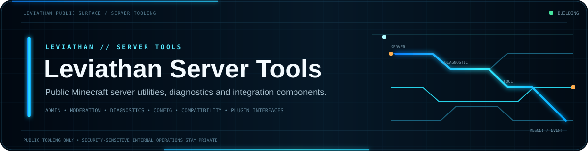
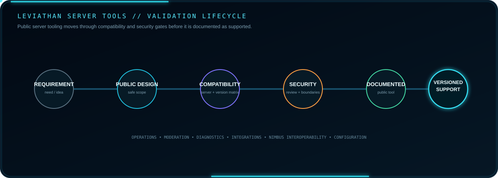
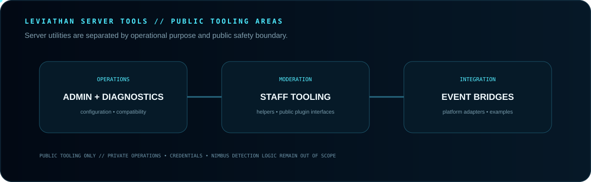

 

**Public Minecraft server utilities, diagnostics, integrations and developer-facing server tooling.**

[Guide](GUIDE.md) · [Integrations](https://github.com/Lapinite/Leviathan-Integrations) · [Examples](https://github.com/Lapinite/Leviathan-Examples) · [Docs](https://github.com/Lapinite/Leviathan-Docs) · [Security](SECURITY.md)

## Tool lifecycle

A tool becomes supported only after installation, compatibility, security expectations, failure behavior and version support are documented and validated.

## Tooling map

Operations, moderation and integration tools stay separated from private operational systems and proprietary detection logic.

## Platform and service boundaries

Server-side integrations may exchange documented events with Leviathan public APIs, integrations, status systems, Discord/community tooling or supported Minecraft platform services. Each boundary uses explicit authentication and permission checks, validated inputs, safe logging and versioned compatibility rules.

Database credentials, remote-console credentials, private infrastructure addresses, internal administrative endpoints and proprietary Nimbus detection logic remain outside the public repository.

## Compatibility

Supported server software and Minecraft versions are documented per tool as implementations are released and tested. Compatibility claims should identify the exact environments that have been validated.

## Security boundaries

Public code and documentation must not contain server credentials, remote-console passwords, database credentials, private keys, webhook credentials, bot tokens, private infrastructure addresses, internal administrative endpoints or personal information.

Configuration examples should use placeholders or environment-variable names.

## Nimbus relationship

Nimbus is part of the broader Leviathan security ecosystem. Public Server Tools may document supported interoperability and public-facing server workflows, but proprietary anti-cheat implementation details and security-sensitive detection logic remain private.

## Related repositories

<a href="https://github.com/Lapinite/Leviathan-Integrations"><strong>Integrations</strong></a> ·
<a href="https://github.com/Lapinite/Leviathan-Examples"><strong>Examples</strong></a> ·
<a href="https://github.com/Lapinite/Leviathan-Docs"><strong>Docs</strong></a> ·
<a href="https://github.com/Lapinite/Leviathan-Status"><strong>Status</strong></a> ·
<a href="https://github.com/Lapinite/Leviathan-API-Docs"><strong>API Docs</strong></a>

## Project status

This repository is being built out as public server tooling is prepared, validated and documented. Development-stage items are not automatically public releases.
